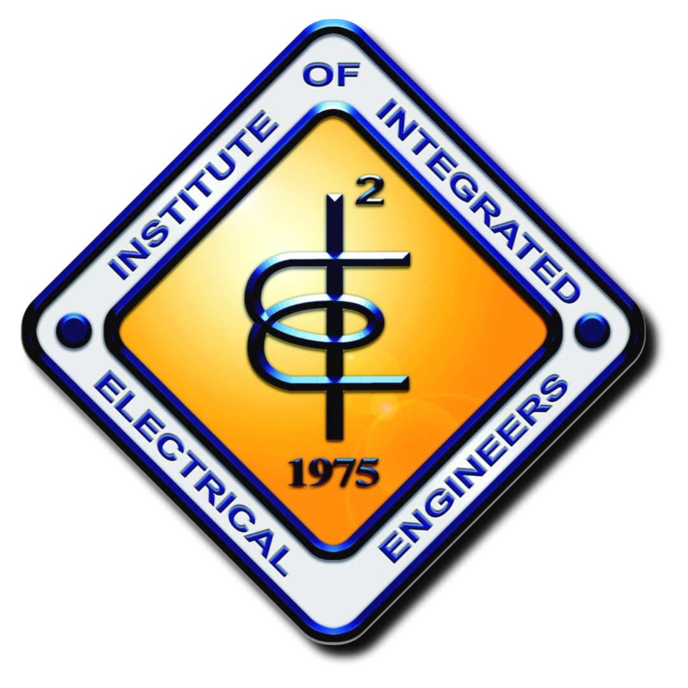
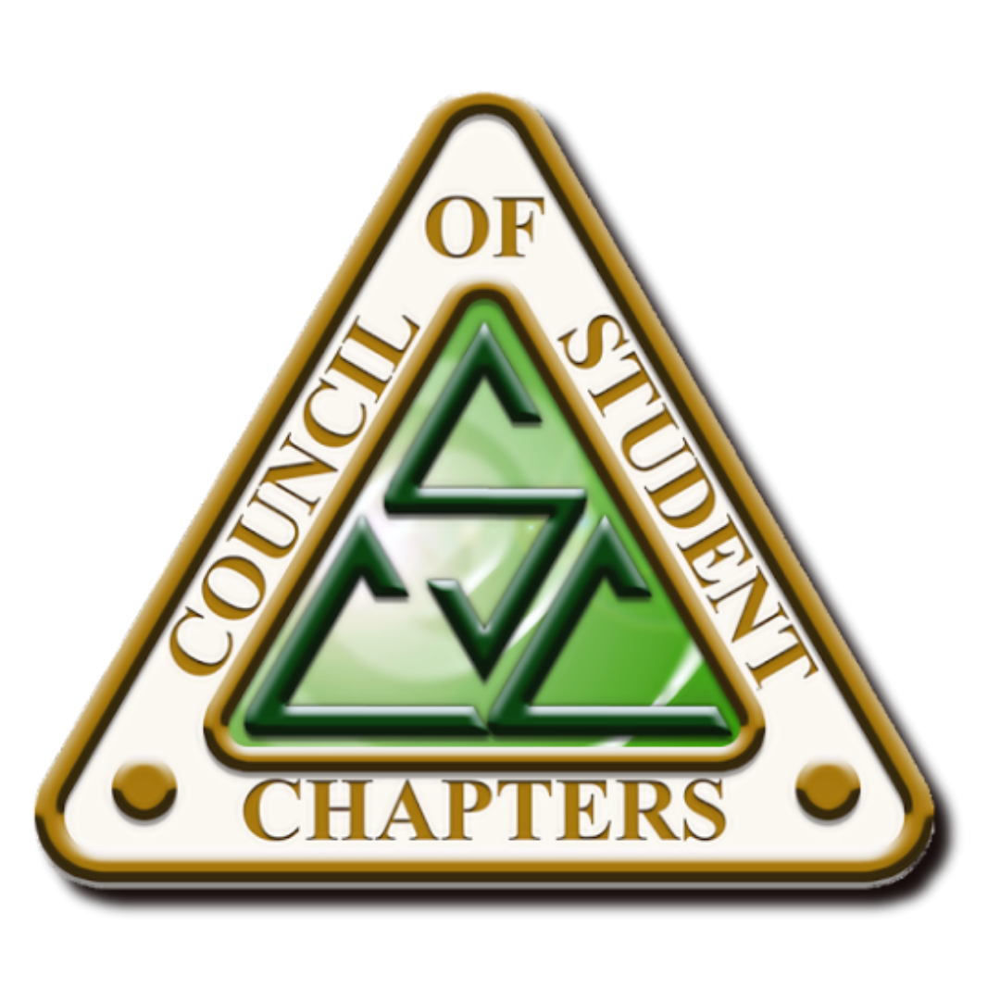

# iieecsc
<!DOCTYPE html>
<html lang="en">
<head>
<meta charset="UTF-8" />
<meta name="viewport" content="width=device-width, initial-scale=1.0" />
<title>IIEE - CSC</title>

<link href="https://fonts.googleapis.com/css2?family=Poppins:wght@300;400;600;700&display=swap" rel="stylesheet">

</head>

<body>

<!-- NAVBAR -->

  

    
    
    

      Institute of Integrated Electrical Engineers of the Philippines Inc.
      Council of Student Chapters
    

  

  

    <a onclick="showHome()">Home</a>
    <a onclick="showAbout()">About</a>
    <a href="#">Events</a>
    <a href="#">Officers</a>
    <a href="#">Membership</a>
    <a href="#">Contact</a>
    <a onclick="toggleTheme()">🌓</a>
  

<!-- HERO -->
<section class="hero" id="home">
  

    
    
  

  <h1>IIEE - Council of Student Chapters</h1>
  
Committed to serve and cultivate future Electrical Engineers

</section>

<!-- ABOUT -->
<section class="about" id="about">

  

    
    <h2>WHAT IS IIEE-CSC?</h2>
  

  

    The IIEE-CSC is a non-stock, non-profit organization that serves as the official umbrella organization of all recognized electrical engineering and electrical technology student chapters across the country. It functions under the supervision of the IIEE Student Affairs Committee (SAC).
  

  

    

      <h3>OUR VISION</h3>
      
To be the best and most prestigious technical student organization in the Philippines.

    

    

      <h3>OUR MISSION</h3>
      <ul>
        <li>To help in improving the academic performance of all Electrical Engineering (EE) and Electrical Technology (ET) students in the archipelago and to serve as a channel of information about current issues and trends in EE and ET education system and industry.</li>
        <li>To hone and nurture the leadership abilities, skills, and principles of student members in order to act with integrity and passion to serve as future leaders of the IIEE and its country.</li>
        <li>To foster unity among its members by acting as the core and prime mover for programs and activities that will provide opportunities for personal growth and self-development of its members.</li>
        <li>To encourage its members to support, participate, and undertake the challenges of globalization and social awareness.</li>
      </ul>
    

    

      <h3>OUR PURPOSE</h3>
      <ul>
        The IIEE-CSC shall at all times:
        <li>Provide students with beneficial opportunities participate in relevant academic, professional, networking, and cultural activities;</li>
        <li>Energize student interest, awareness, and understanding of the duties and responsibilities of an electrical engineering student and imbibe them with desirable motivations and correct values;</li>
        <li>Formulate and adopt policies, measures, and programs with the view of fostering the educational advancement In the field of electricity;</li>
        <li>Establish unity and closer cooperative relationships among students of different schools and between student-professional, and studentgraduate. and;</li>
        <li>Defend, promote and protect the rights and welfare of the students.</li>
      </ul>
    

  

</section>

<footer>
© 2026 IIEE-CSC | All Rights Reserved
</footer>

</body>
</html>
